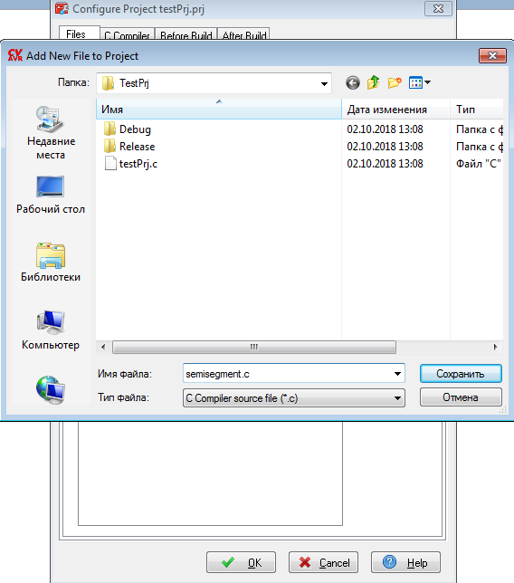

# Рекомендации по организации архитектуры ПО для микроконтроллеров

В качестве доп. материала предлагаю ознакомиться со [стандартом написания программ на С](https://www.gnu.org/prep/standards/html_node/Writing-C.html#Writing-C).

## Модульность

Организация кода ПО (программное обеспечение) имеет очень важную роль, так как это улучшает его читаемость и может исключить огромное количество ошибок. Часто программы для микроконтроллеров представляют собой следующую схему: 

***
<p align="center">
драйверы оборудования (железа) + алгоритмы
</p>

***

По этой схеме в коде программы вся логика разбивается на ответственные части, так, например, в первой лабораторной у вас присутствуют модули энкодера и семисегментного индикатора, а также основная логика программы, которая использует драйверы модулей.

Под модулями часто понимают составную часть программы (её логики), поэтому необходимо научиться добавлять `.с` файлы в проект, для того, чтобы размещать в отдельных модулях код. Для CodevisionAVR это делается следующим образом:
- открыть конфигурацию проекта (Project -> Configuration)

<p align="center">

</p>

<p align="center">

</p>

- добавить новый `.с` файл и назвать его в соответствии с названием драйвера или алгоритма (части алгоритма).

<p align="center">

</p>

<p align="center">

</p>

Для приведенного примера, рекомендуется весь код, который относится к семисегментному индикатору, вынести в модуль драйвера этого индикатора (`.с` файл, например назван `semisegment.c`). Так, например, в модуль попадает список кодов цифр, по которым драйвер будет выводить их на индикатор:
```c++
const unsigned char segments[] = {0x3F, 0x06, 0x5B, 0x4F, 0x66, 0x6D,0x7D, 0x07, 0x7F, 0x6F};
```

Также часто любой модуль имеет функции `init` и `deinit`, которые выполняют задачи инициализации и освобождения ресурсов. Если первая функция реализуется почти постоянно, то вторая очень часто опускается. Для нашего случая функция инициализации в модуле индикатора может выглядеть следующим образом:
```c++
void semiseg_init( void )
{
    /* Setup latch pins direction */
    DDRA |= 0b00111110;
    
    /* Setup code pins direction */
    DDRC = 0xFF;
}
```

> В названии функции всегда есть две части: **название модуля** и **сама функция**. Сделано это с целью разграничения, так как функция инициализации (а может и другая функция) может присутствовать сразу в нескольких модулях.

При правильном использовании модульности для каждого модуля (например, `semisegment.c`) создаётся файл заголовка (обычно назван также, для нашего примера `semisegment.h`), в который размещаются прототипы функций, открытые для использования другими модулями (или алгоритмами). Для CodeVisionAVR рекомендуется создавать файл `.h` не через конфигурацию проекта, а просто создать файл в папке рядом с `.c` файлом. 

> Ведь внутри модуля могут быть и закрытые функции, которые по задумке нельзя использовать снаружи модуля.

Создаётся заголовочный файл по аналогии с `.с` файлом. Для примера, в файле заголовка могут быть перечислены функции индикатора:
```c++
#ifndef SEMISEGMENT_H_
#define SEMISEGMENT_H_

void semiseg_init ( void );
void semiseg_print ( int number );

#endif
```

> Конструкция `#ifndef SEMISEGMENT_H_`, `#define SEMISEGMENT_H_` и `#endif` используется для защиты заголовочного файла от двойного включения. Подробнее полистайте [Wiki](https://ru.wikipedia.org/wiki/Include_guard). Использовать ее рекомендуется в каждом файле, при этом название `SEMISEGMENT_H_` меняется в зависимости от названия заголовочного файла и должно быть уникальным для каждого заголовочного файла.

Для использования функций модуля индикатора в другом модуле производится "подключение" модуля:
```c++
#include <semisegment.h>
```

> Это не подключение библиотеки! Это сообщение модулю, какие функции другого модуля можно использовать; код модуля сразу компилируется с кодом основной программы.

> Если у вас появились проблемы с компиляцией - удалите заголовочный файл из конфигурации проекта (не удаляйте с диска!). Кажется, он пытается компилировать заголовочный файл, что приводит к ошибкам.

Таким образом, принцип модульности позволяет разбить логику программы на малые кусочки, что позволит в дальнейшем упростить переносимость программы на другие платформы и переиспользование кода в других проектах. Более того, модульность поднимает читаемость кода на другой уровень. Можно провести аналогию с тем, что без модульности код представляет собой письмена на эльфийском, а с модульностью на человеческом языке (;

Пример результирующего main.c (или по-другому названный главный файл с функцией main()):
```c++
#include <io.h>
#include <delay.h>
#include <semisegment.h>

void main()
{
	semiseg_init();

	/* Other initialization code */

	while ( 1 )
	{
		semiseg_render_number();

		/* Other base iterational code */
	}
}
```

## Комментарии

Практика комментариев распространена очень широко и не надо объяснять их важность. Часто комментарии могут относиться к кусочку кода:
```с++
/* This part of code fills array with ordered indexes */
```

а также к функциям модуля:
```с++
/* This function calculates sum of two numbers, input - numbers to sum, output - result */
```

Примеров того, как писать комментарии (стиль комментариев), в интернете очень много. В данной рекомендаций предлагаю обратить внимание на стиль, который стандартизован для системы Doxygen. В таком стиле в заголовке будет располагаться прототип функции получения угла поворота модуля драйвера энкодера:
```с++
/**
 * @brief    Get angle position of encoder
 * @return   Angle position 0-360 [degree]
 */
int encoder_get_angle_degree( void );
```

Для функции с параметрами будет присутствовать ещё один важный тэг `@param`, также тэгом `@note` можно отметить некоторые особенности функции:
```с++
/**
 * @brief    Print 5-digit number on indicator
 * @param    number   Number to print on indicator
 * @note     In case if number contains more digits (123456), less significant will be written (23456)
 */
void semiseg_print( int number );
```

## Константы модулей, конфигурация

Часто модуль содержит ряд параметров, которые не меняются в ходе работы, их можно назвать константными. Для примера можно привести параметр перевода тиков энкодеры в угол поворота. Практика показывает, что самым оптимальным методом будет размещение таких константных параметров в начале модуля (`.с` файла) с помощью директивы `define` и дальнейшее использование по коду модуля:
```c++
#define ENCODER_TICK_2_ANGLE 9

...

int angle = ticks * ENCODER_TICK_2_ANGLE;
```

> Определение директивой константы приводит к двум важным фактам. Во-первых, константы внутри модуля не видны снаружи другого модуля. Во-вторых, во время компиляции вместо имён констант (например `ENCODER_TICK_2_ANGLE`) подставляются значения этих констант, то есть стоит __аккуратно пользоваться, если вы пишите не просто число, а выражение (например, 360/40)__.

## Форматирование текста программы

Блоки кода функций, итераций циклов и других блоков (`{ код }`) принято формировать на один отступ дальше предыдущего уровня:
```c++
int max ( int a, int b )
{
	if ( a > b )
	{
		return a;
	}
	else
	{
		return b
	}
}
```

В примере блок кода функции `max()` имеет табуляцию 1, для кода условий `if-else` табуляция на втором уровне. Аналогично с циклами:

```c++
int sum ( int numbers[], int n_count )
{
	int res_sum = 0;

	for ( int i = 0; i < n_count, i++ )
	{
		res_sum += numbers[i];
	}

	return res_sum;
}
```

## Использование переменных

### Название переменных

При использовании переменных можно руководствоваться правилом "Название переменной = ее назначение". Так, например, если переменная хранит количество значений, снятых с АЦП, то ее можно назвать `adc_sample_count` или `n_adc_sample`. В данном случае главное не пользоваться одно-двухзначными названиями переменных. Такие переменные возможно использовать только для итеративной переменной в циклах (`i, j, k`...). При этом можно также заменить односложные итеративные переменные на, например, `adc_sample_idx`. Таким образом расширенное название переменной делает ее самодокументированной!

### Выбор типа

При использовании переменных важно не забывать и о выборе типа переменной. В качестве напоминания важно не забывать:  
- Тип данных `char` имеет три вида: `char`, `signed char` и `unsigned char`. Первый используется для хранения символов, второй и третий - для хранения знаковых и беззнаковых числовых значений. Просто `char` не регламинтируется стандартом, поэтому нельзя явно надеяться на то, что он является знаковым или беззнаковым.  
- Типы данных `short`, `int`, `long` по-умолчанию являются знаковыми (`signed`), поэтому этот модификатор с ними редко используется.  
- Знаковые типы используются для хранения негативных значений. Если в программе существуется возможность записать в переменную отрицательное значение - лучше сделать ее знаковой.  
- Беззнаковые типы не имеют отрицательного диапазона, поэтому могут хранить больше положительных значений. Используются часто для хранения количества элементов, положительной индексации и других задач.  
- При переполнении (превышение максимального значения) в переменной прододжается счет с минимального значения:  
```
signed char: ... 126, 127, -128, -127, ...
unsigned char: ... 254, 255, 0, 1, ...
```
- Чтобы узнать размер типа переменной, самый точный и нажежный способ - проверить вывод `sizeof()`:
```c++
sizeof(int)
sizeof(long)
...
```
