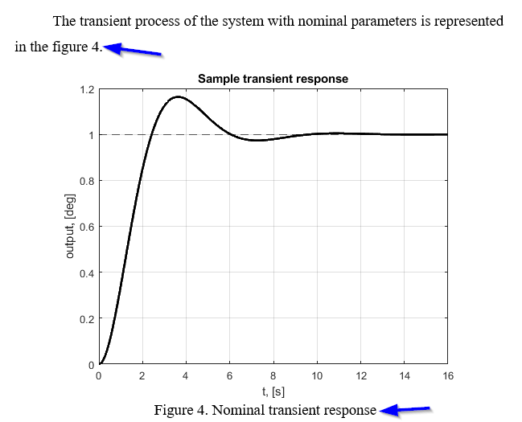
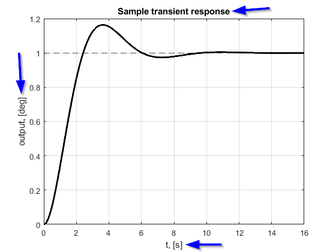
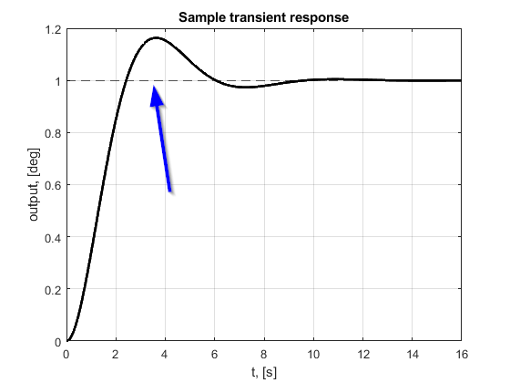
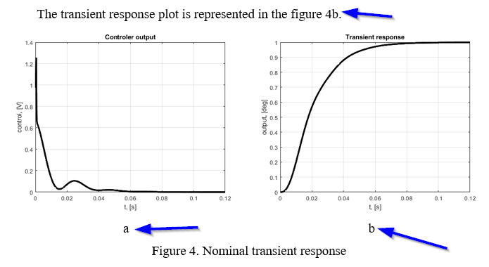
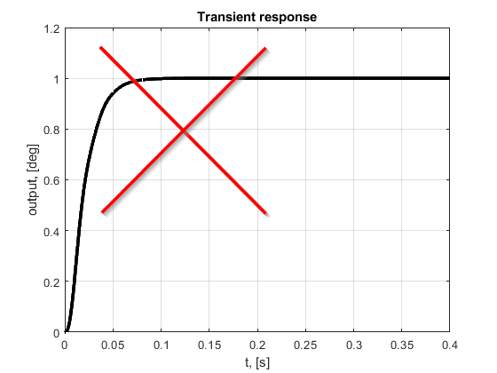
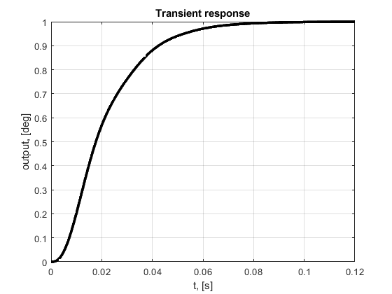
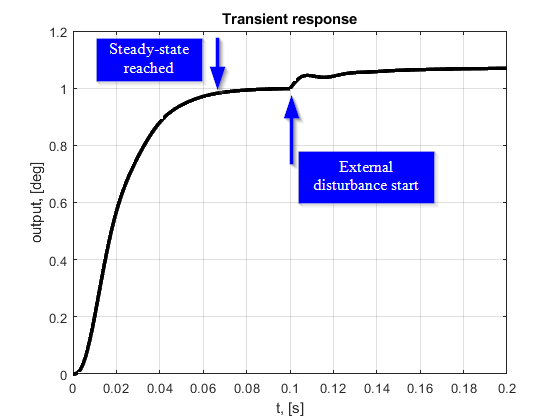

# Hi, dudes!

This guide is for you just to give an idea how to create good report! It it splitted into parts, so I hope you will use it for your reports!

## 1. Common

1. Always write next parts: 
    - **Objective** - what you`re going to achieve,
    - **Description** - explain what work includes and which theoretical basis it has undelying, 
    - **Picture(-s) of your system** - just to have better representation of the system to work with, don`t forget about description of each part on the picture,
    - **Conclusion** - describe the results you`ve achived.

2. Never end any part of your work with table/figure. Any chapter of the work must be ended with a bunch of text. As a common thing, at the end of the chapter you can describe your results.

## 2. Charts / Plots

1. The description of the plot must be before representation followed by plot capture! What I mean is:

> That means that each plot must have a small descprition before it is represented.

2. Dont forget about plot title, axes names and units! It is neccessary to set certain units cause without them people can not understand what charts represent. Axes names - explain what axes are responsible for.

3. Transient response chart better have one more straight line representing steady-state level (reference value).

4. Representation of multiple plot images in the figure must be subscribed with letters 'a', 'b', ...

5. If your transient response reaches steady-state level in 0.06 seconds, the full time of plot should not be more than 0.12 seconds. The common rule - steady-state should file not more than 50 percent of full plot time.

6. Representation of external disturbances influence. To show how external disturbance affects your system, you should start external disturbance signal **only** after your system reached stady state.

7. Dont use screenshots of scope is Simulink - better use `plot()` function in MATLAB for creation of report plots.

8. Dont use bright colors for plotting (they are hardly visible in the report).

## 3. Text representation

1. The text in the report must be **Width aligned** with **1.25cm first line indent**.

2. Examination of transient response(-s) must include small conclusion about main quality characteristics:
- Time of response [numeric value of time];
- Time of first reach (first moment when reference value is reached) [numeric value of time];
- Static error [numeric value of difference between reference and steady state values];
- Is stable [boolean value if transient response reaches 5% border of reference value during steady state];
- Overshoot [numeric percentage value].
