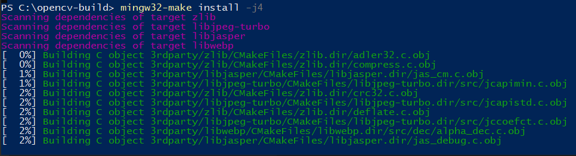

# Установка OpenCV с помощью Qt5 + MinGW

За основу взят вот этот [гайдик от Qt](https://wiki.qt.io/How_to_setup_Qt_and_openCV_on_Windows).

> **Туториал проверен на `Qt 5.12.5` + `MinGW 7.3.0 64-bit`.**

## OpenCV sources

Для начала скачаем архив исходников OpenCV по [ссылке](https://github.com/opencv/opencv/archive/3.4.7.zip). 

Положим на диск `C:\` и распакуем, получим папку по пути `C:\opencv-3.4.7`, внутри которой есть папки `3rdparty`, `apps`, `cmake`, и т.д.

> Вы можете расположить по удобному для вас пути, просто все дальнейшие действия проводите с учетом собственных перестановок =)

## CMake

Если у вас не установлен `cmake` - установим, скачав по [ссылке](https://github.com/Kitware/CMake/releases/download/v3.16.0-rc1/cmake-3.16.0-rc1-win64-x64.msi).

Во время установки не забудьте выбрать опции:
- `Add CMake to the system PATH for all users`.
- `Create CMake Desktop Icon` - создать иконку на рабочем столе.

> **Если у вас нетбук с разрядностью х32 - стоит скачать другой файл установки, который можно найти у них на сайте**

## Qt5

Качаем с [сайта](https://www.qt.io/download-qt-installer) установочный файл и стартуем.

> Если ваша сеть находится под прокси - укажите параметры в меню `Настройки` в первом окне снизу слева.

Путь можно выбрать любой, в примерах будет `C:\Qt`

Пролистывайте окна и в меню `Выбор компонентов` выбираем следующее:
- `Developer and Designer Tools` -> `MinGW 7.3.0 64-bit` (для x32 системы, соответсвенно, `MinGW 7.3.0 32-bit`).
- В одной из вкладок `Qt 5.12.5` выбираем такой же `MinGW 7.3.0 64-bit`.
- Выбранные компоненты по-умолчанию не сбрасываем.

Ждем окончания установки, после добавляет пути в переменную окружения `PATH` для компилятора `MinGW` и `Qt`:
- Открываем меню `Изменение переменных среды текущего пользователя`, можно найти в поиске.
> или через `Панель управления` -> `Система` -> `Дополнительные параметры системы` -> `Переменные среды`.
- Дважды кликаем по переменной `Path` в разделе `Переменные среды пользователя для ...`.
- Нажимаем `Создать`, затем `Обзор` -> выбираем путь до `C:\Qt\Tools\mingw730_64\bin`.
- Добавляем еще один путь (`Создать` -> `Обзор`) до `С:\Qt\5.12.5\mingw73_64\bin`.
- `OK` -> `OK`.

## Компиляция

Открываем CMake (графическое приложение) и заполняем поля:
- `Where is the source code` -> `C:\opencv-3.4.7`;
- `Where to build the binaries` -> `C:\opencv-build` (да, папки пока такой нет).

Нажимаем `Configure` - кнопка по середине окна.

Выбираем генератор `MinGW Makefiles` и `Use default native compiler`.

*Если что-то идет не так - выбираем `Specify native compilers` и указываем пути:*
- С -> `C:/Qt/Tools/mingw730_64/bin/gcc.exe`
- С++ -> `C:/Qt/Tools/mingw730_64/bin/g++.exe`
В результате начнется генерация файлов для компиляции и в случае успеха вы увидите `Configuring done` в консоли.

Настраиваем дополнительные параметры:
- `WITH_QT` -> `ON`;
- `WITH_OPENGL` -> `ON`;
- `ENABLE_PRECOMPILED_HEADERS` -> `OFF`;
- Клацаем `Configure`.

Если все окей - нажимаем `Generate`, дожидаемся окончания (`Generating done`) и выходим из CMake.

Переходим в директорию `C:\opencv-build` и в командной строке набираем `powershell`, вот так:
<p align="center">

</p>

Нажимаем `Enter` и появляется окно Powershell, в нем набираем `mingw32-make install -j4` и нажимаем `Enter`, начнется сборка исходников:
<p align="center">

</p>

> Если у вас больше 4х ядер в процессоре - запускайте с опцией `-j<кол-во ядер>`!
Дожидаемся окончания и в результате наши исходники собраны! Осталось добавить в `PATH` путь до бинарников `opencv`: по предыдущим шагам добавления закиньте путь `C:\opencv-build\install\x64\mingw\bin` 

## Sample Qt+OpenCV Project

Открываем Qt Creator и создаем новый проект `Проект без Qt` -> `Приложение на языке С++`.

В следующих окнах настраиваем проект:
- Название выберите самостоятельно. Расположение проекта не должно содержать кирилицы (русских букв)!
- Система сборки - `qmake`.
- Комплект - `Desktop Qt 5.12.5 MinGW 64-bit`.

В `.pro` файл добавляем:
```CMake
OPENCV_DIR=C:\opencv-build\install

INCLUDEPATH += $${OPENCV_DIR}\include
LIBS += -L$${OPENCV_DIR}\x64\mingw\lib \
        -lopencv_core347        \
        -lopencv_highgui347     \
        -lopencv_imgcodecs347   \
        -lopencv_imgproc347     \
        -lopencv_features2d347  \
        -lopencv_calib3d347
```

В файл `main.cpp` записываем следующий код чтения изображения примера:
```cpp
#include <opencv2/highgui.hpp>

using namespace std;

int main()
{
    cv::Mat sample_image = cv::imread("C:\\opencv-3.4.7\\samples\\data\\lena.jpg");

    cv::imshow("sample_window", sample_image);
    cv::waitKey(0);

    return 0;
}
```

После компиляции и запуска у вас должно появитьс окно с изображением примера:
<p align="center">

</p>

## Готово! Можете заниматься разработкой приложений! Успехов!
